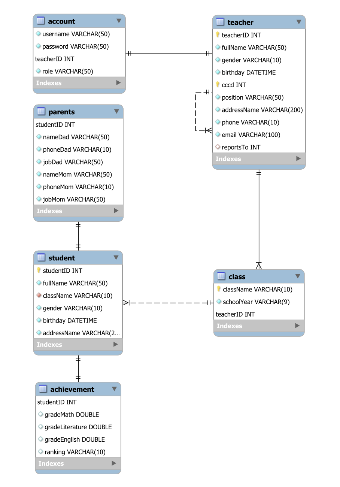

# Website quản lý học đường

## Mục đích

Hỗ trợ giáo viên trong việc quản lý và lưu trữ thông tin của học sinh một cách dễ dàng, thuận tiện.

## Phạm vi và đối tượng

Trường Tiểu học.\
Dành cho giáo viên chủ nhiệm và ban giám hiệu nhà trường.


## Phân quyền:

### Chức năng dành cho giáo viên (chủ nhiệm):
- Đăng nhập theo tài khoản đã được cấp (bởi ban giám hiệu)/ Đăng xuất;
- Quản lý tài khoản: cho phép sửa username/ password;
- Quản lý thông tin cá nhân: cho phép xem, sửa thông tin cá nhân của chính mình;
- Quản lý học sinh: cho phép thêm/ sửa/ xóa thông tin học sinh, phụ huynh mà giáo viên đó chủ nhiệm;
- Quản lý điểm số, xếp loại học lực của học sinh do mình chủ nhiệm;
- Thống kê, đánh giá các số liệu học tập bằng biểu đồ;
- Xem danh sách giáo viên của trường.

### Chức năng dành cho ban giám hiệu (hiệu trưởng):
- Đăng nhập/ Đăng xuất;
- Quản lý tài khoản: cho phép sửa username/ password;
- Quản lý thông tin cá nhân: cho phép xem, sửa thông tin cá nhân của chính mình;
- Quản lý giáo viên: xem danh sách, thêm/sửa/xóa thông tin của giáo viên;
- Quản lý học sinh: cho phép thêm/ sửa/ xóa thông tin học sinh, phụ huynh của tất cả học sinh;
- Thêm tài khoản mặc định cho giáo viên chủ nhiệm. 
- Quản lý điểm số, xếp loại học lực của học sinh của tất cả học sinh;
- Thống kê, đánh giá các số liệu học tập bằng biểu đồ;

## Công nghệ sử dụng

- Server Backend: Nodejs Express
- App Frontend: Reactjs
- Database: MySQL server

## Bản demo heroku

Truy cập: https://thaobone.herokuapp.com

|    role    |    username   |  password |
|:----------:|:-------------:|:---------:|
|   member   |      bone     |    jack   |
|   admin    |    president  | president |

## Các thư mục phát triển của Website

- Report repository: [SMS - Report](https://github.com/ttsalpha/school-management-system)
- Front end repository: [SMS - Client](https://github.com/ttsalpha/school-management-system-client)
- Back end repository: [SMS - Server](https://github.com/ttsalpha/school-management-system-server)

## Hướng dẫn cài đặt

- Back end: clone SMS - Server -> `yarn install` -> `yarn dev`
- Front end: clone SMS - Client -> `yarn install` -> `yarn start`

```js
// Đi đến file Misc.js trong src của front end, chọn server cần kết nối:
export const api = axios.create(({
// chọn một trong hai baseURL
  baseURL: 'http://localhost:3001/', // kết nối với sms server tại local
  baseURL: 'https://thaobone-server.herokuapp.com/' // mặc định kết nối heroku
}))
```

## Nhóm phát triển

- [Bùi Thị Phương Thảo](https://github.com/thaobone163)
- [Trần Thế Sơn](https://github.com/ttsalpha)

## Lược đồ quan hệ thực thể


## Lược đồ dữ liệu quan hệ

